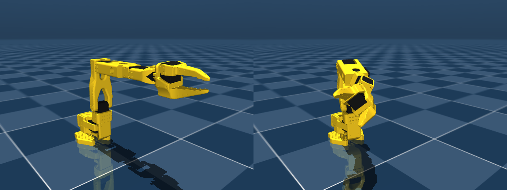

# SO111（6軸版 SO101）- URDF / MuJoCo 記述

`SO111` は SO101 アームに 1 軸を追加した構成で、`elbow_flex` と `wrist_flex` の間に前腕ロール
（`forearm_roll`）が入ります。新規の 3D プリント部品は 2 つ: `so111_j3_j4_v1`（SO101 の
under-arm を置き換え、J4 モータを保持）と `so111_j4_j5_v1`（J4 ホーンに付くカップで、J5 モータを保持）。
ベースから上腕まで、および手首からグリッパまでは SO101 の既存部品そのままです。

`scene.xml` を MuJoCo で描画したもの。左: ゼロ姿勢、右: `forearm_roll` を含む全関節を動かした姿勢。

## ファイル

- `so111_new_calib.urdf` / `so111_new_calib.xml` - URDF と MJCF。メッシュは `assets/` からの相対パスで参照。
- `scene.xml` - MJCF を include した MuJoCo シーン（床・照明）。
- `joints_properties.xml` - STS3215 のジョイント既定値（`Simulation/SO101` からコピー）。
- `assets/` - m 単位の STL。既存部品は `Simulation/SO101/assets` からコピー、`so111_*.stl` は Fusion の部品設計から書き出し。

## 関節構成

| # | joint | parent -> child | 可動域 (rad) |
|---|-------|-----------------|--------------|
| 1 | shoulder_pan | base_link -> shoulder_link | -1.92 .. 1.92 |
| 2 | shoulder_lift | shoulder_link -> upper_arm_link | -1.745 .. 1.745 |
| 3 | elbow_flex | upper_arm_link -> lower_arm_link | -1.69 .. 1.69 |
| 4 | forearm_roll | lower_arm_link -> forearm_link | -1.571 .. 1.571 |
| 5 | wrist_flex | forearm_link -> wrist_link | -1.658 .. 1.658 |
| 6 | wrist_roll | wrist_link -> gripper_link | -2.744 .. 2.841 |
| 7 | gripper | gripper_link -> moving_jaw_so101_v1_link | -0.175 .. 1.745 |

各関節は子リンク座標系の +Z 軸まわりに回転します。ツール座標系は SO101 と同様に
`gripper_frame_link`（URDF）/ `gripperframe` サイト（MJCF）で示しています。

ゼロ姿勢: 既存の関節は `so101_new_calib` と同一（可動域中央。上腕が垂直、前腕が水平）。
`forearm_roll = 0` は組み立て時の前腕まっすぐの姿勢（カップが正立）です。

## 生成手順

1. `6Dof/tools/gen_spec.py` が `Simulation/SO101/so101_new_calib.urdf` から Fusion 用の組立仕様を作り、
   `fusion_build_assembly.py` が Fusion 上に SO101 のリンクアセンブリを構築します
   （1 リンク = 1 コンポーネント、URDF の関節名と同名の as-built 回転ジョイント）。
2. そのアセンブリ（Fusion ドキュメント `SO111-Assembly`）に新規 2 部品とモータを配置し、
   `elbow_flex` / `forearm_roll` / `wrist_flex` で結合しました。
3. `gen_so111_description.py` が Fusion から抽出したリンク／ジョイントの座標系
   （`tools/build/so111_fusion_dump.json`）を読み、URDF / MJCF を書き出します。変更のないリンクは
   SO101 の慣性とメッシュを流用。`lower_arm_link` と `forearm_link` の慣性はメッシュから計算しており、
   3D プリント部品の実効密度 497 kg/m^3 と STS3215 の集中質量 57.7 g を用いています
   （いずれも SO101 URDF のリンク質量からの回帰値。当てはめ残差は ±13 g 以内）。
4. `validate_so111.py` が両ファイルを読み込み（yourdfpy、MuJoCo）、Fusion アセンブリと順運動学を照合し、
   短いシミュレーションを実行します。
